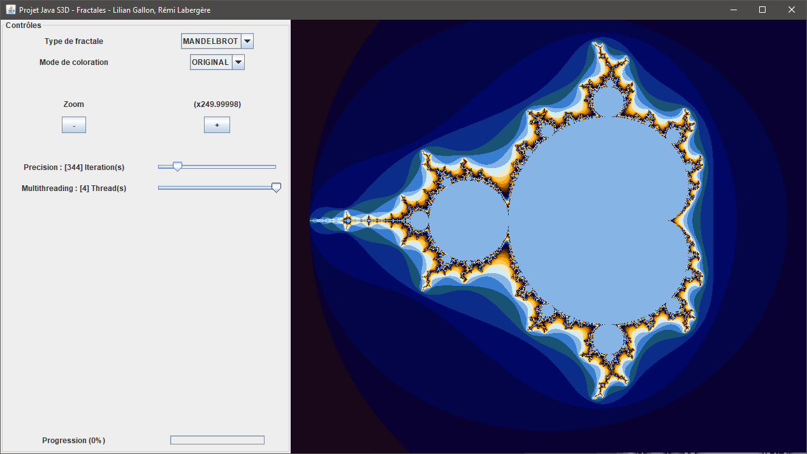

# Fractals explorer

 

A java fractals explorer made using MVC design pattern. Made for the Object Oriented Programming course at the Bordeaux Intitute of Technology (grade: 16/20).

## 1. Getting started
### 1.1 Prerequisites
- Java SDK >= 8

### 1.2 How to use it
Download a [release](https://github.com/N3ROO/Fractals_explorer/releases) and double click the downloaded .jar file. Or you can type `java -jar filename.jar`.

### 1.3 Setting up your dev environment
Open IntelliJ, click on open, and select the repository folder.
  
## 2. Miscellaneous
### 2.1 Changelog
The changelog is available [here](CHANGELOG.md).

### 2.2 Authors
- **N3ROO** - *Initial work* - [Github](https://github.com/N3ROO) [Website](https://n3roo.github.io/)
- **Rems19** - *Initial work* - [Github](https://github.com/Rems19)

### 2.3 License
This project is licensed under the GPL-3.0 - see the [LICENSE.md](LICENSE.md) file for details